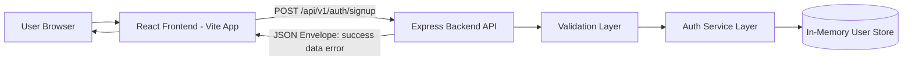
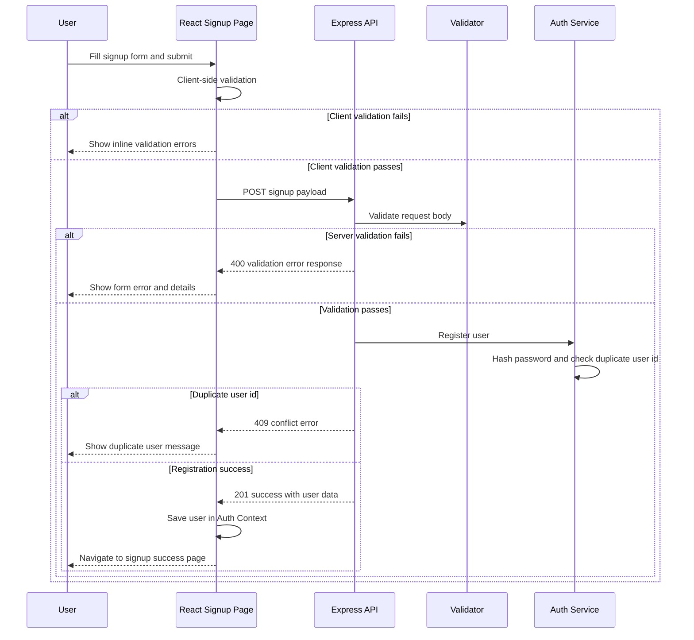

# Project Architecture and Workflow Document (Demo)

## 1. Purpose
This document explains the architecture and working flow of the Form C Signup demo project.
It is designed for presentation and demo walkthroughs.

## 2. Solution Overview
The project is a full-stack JavaScript application with:
- A backend API built with Node.js and Express
- A frontend web app built with React and Vite
- A signup flow integrated end to end

The solution follows a layered backend design and a feature-oriented frontend design.

## 3. High-Level Architecture

## 4. Backend Architecture
Backend root: package.json

### 4.1 Backend Layers
- Entry and server boot: src/server.js
- App configuration and middleware wiring: src/app.js
- Route layer: src/features/auth/auth.routes.js
- Validation layer: src/features/auth/auth.validator.js
- Controller layer: src/features/auth/auth.controller.js
- Service layer: src/features/auth/auth.service.js
- Error handling: src/middleware/error-handler.js and src/middleware/not-found.js
- Response standardization: src/utils/response.js
- Config: src/config/env.js

### 4.2 Backend Technical Notes
- Security middleware: helmet
- CORS enabled for frontend-backend communication
- Request logging via morgan
- Passwords hashed with scrypt and per-user random salt
- Duplicate user id protection implemented
- Data store is currently in-memory using Map (demo mode)

### 4.3 API Contract (Signup)
Endpoint: POST /api/v1/auth/signup

Success response shape:
- success: true
- data: user object
- error: null

Failure response shape:
- success: false
- data: null
- error: code, message, optional details

## 5. Frontend Architecture
Frontend root: frontend/package.json

### 5.1 Frontend Structure
- App entry: frontend/src/main.jsx
- Route configuration: frontend/src/app/AppRoutes.jsx
- Signup feature UI: frontend/src/features/signup/SignupPage.jsx
- Signup feature styles: frontend/src/features/signup/SignupPage.module.css
- Success page: frontend/src/pages/SignupSuccessPage.jsx
- Auth context: frontend/src/context/AuthContext.jsx
- API client: frontend/src/services/authApi.js

### 5.2 Frontend Design Notes
- React functional components only
- React Router for page flow
- Local form state plus Auth Context for shared user data
- CSS Modules for component-level styling
- Client-side validation before API call
- Form-level and field-level error rendering

## 6. End-to-End Workflow

## 7. Quality and Testing Workflow

### 7.1 Backend Verification
- Lint: npm run lint
- Tests: npm test
- Backend tests include:
  - Health endpoint success
  - Signup success path
  - Signup validation failure
  - Duplicate user conflict

### 7.2 Frontend Verification
- Lint: cd frontend and run npm run lint
- Tests: cd frontend and run npm test
- Build: cd frontend and run npm run build
- Frontend tests include:
  - Empty form validation errors
  - Successful signup and navigation
  - API failure message handling

## 8. Demo Runbook

### 8.1 Start Services
- Backend: run npm run start from project root
- Frontend: run cd frontend then npm run dev

Expected URLs:
- Backend health: http://localhost:3000/health
- Frontend app: http://localhost:5173

### 8.2 Demo Scenario
1. Open frontend signup page.
2. Submit empty form to show validation behavior.
3. Fill valid form and submit to create a user.
4. Show success page navigation.
5. Repeat with same user id to show duplicate conflict handling.

## 9. Current Limitations (Demo Scope)
- User persistence is in-memory and resets on backend restart.
- No database integration yet.
- No authentication token/session lifecycle yet.
- No production deployment pipeline documented yet.

## 10. Recommended Next Phase
- Introduce persistent storage layer (SQL or NoSQL).
- Add authentication and authorization flows.
- Add observability (structured logs, metrics, tracing).
- Add CI pipeline quality gates for backend and frontend.
- Add non-functional test suites (security and performance).
